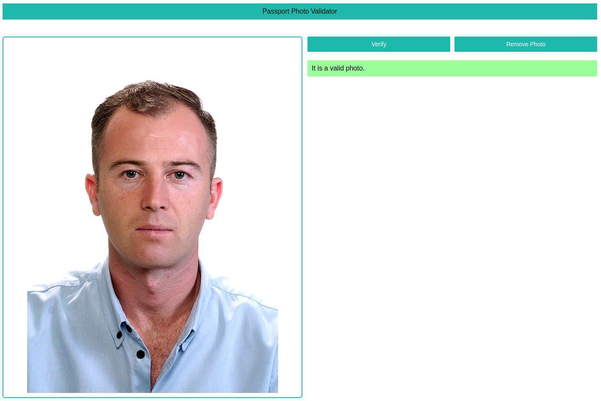
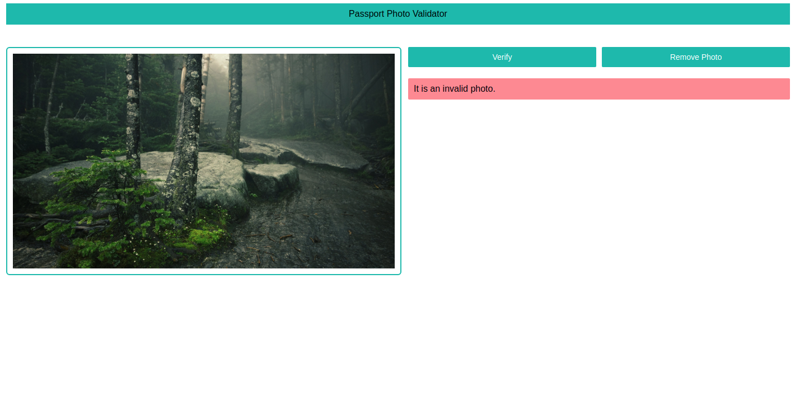

# Passport Photo Validator

It is a simple mini project using AWS lambda function, S3 service and API Gateway and React. This serverless application helps to detect a passport photo of a person using AWS Image Rekognition service.
 
 
> ### Web App Link - http://passportphotodetector.s3-website.us-east-2.amazonaws.com/

 

## Features

- Detect a passport photo

##  Built With

- React
- AWS Lambda Function in Python
- S3
- API Gateway
- AWS Image Rekognition

## Screenshots

 

 

 
